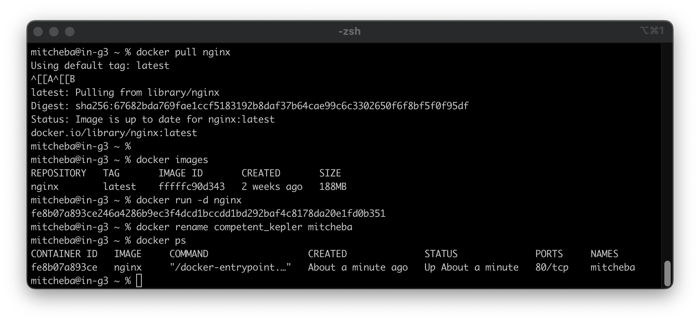
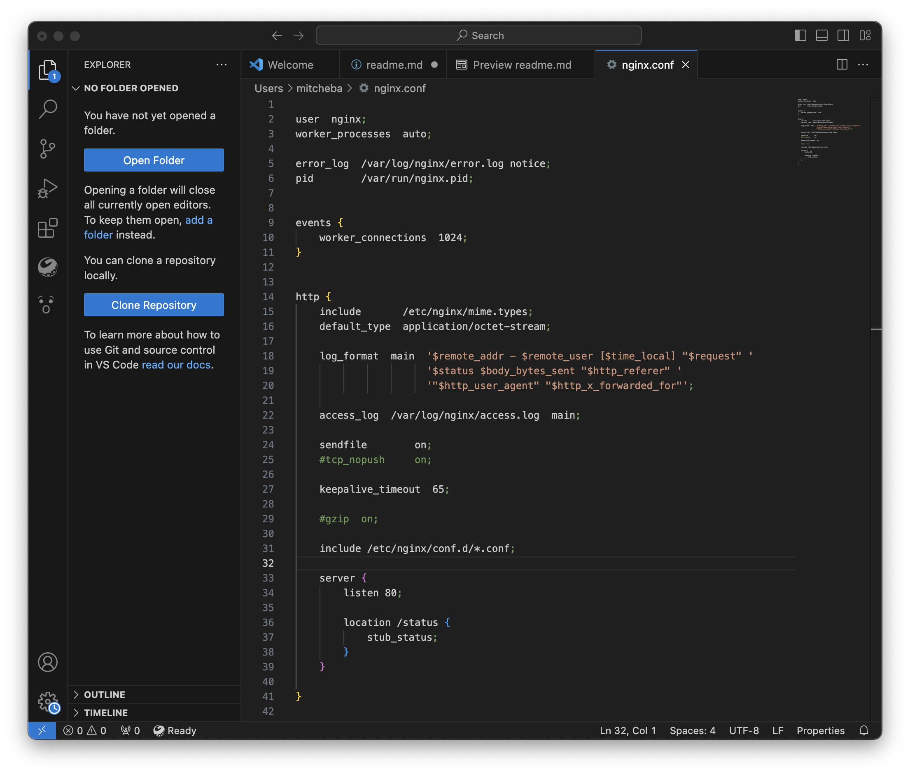

# Simple Docker

## Part 1. Готовый докер

Взять официальный Docker образ от nginx и загрузить `docker pull`

Проверить наличие образа Docker c помощью `docker images`

Запустить образ Docker с помощью `docker run -d nginx`

Поменял название контейнера для удобства.

Проверить, что образ запущен с `docker ps`

Из вывода команды `docker inspect` определить и записать в отчет размер контейнера, список сопоставленных портов и IP-адреса контейнера

Остановить образ Docker с помошью `docker stop [container_name]`

Убедиться, что изображение остановлено с помощью `docker ps`

Запустить Docker с портами 80 и 443 в контейнере, сопоставленным с теми же портами на локальной машине, с помощью команды `run`

Проверить, доступна ли стартовая страница nginx в бразуере по адресу localhost:80

Перезапустить Docker-контейнер с помощью `docker restart [container_name]`

Проверить любым способом, работоспособность контейнера

(После запуска Dockera с портами 80 и 443, создался новый контейнер, переименовал)

## Part 2. Операции с контейнером

Прочитать конфигурационный файл `nginx.conf` внутри докер контейнера через команду `exec`

Создать на локальной машине файл `nginx.conf`

Настроить в нем по пути `/status` отдачу страницы статуса сервера `nginx`

Скопировать созданный файл `nginx.conf` внутрь докер-образа через команду `docker cp`.

Перезапусти `nginx` внутри докер-образа через команду `exec`.

Проверить, что по адресу `localhost:80/status` отдается страничка со статусом сервера `nginx`

Экспортировать контейнер в файл `container.tar` через команду `export`.

Остановить контейнер.

Удали образ через `docker rmi [image_id|repository]`, не удаляя перед этим контейнеры.

Удалить остановленный контейнер.

Импортировать контейнер обратно через команду `import`.

Запустить импортированный контейнер.

Проверить, что по адресу `localhost:80/status` отдается страничка со статусом сервера `nginx`.

### Part 3. Мини веб-сервер

Напиcать мини-сервер на C и FastCgi, который будет возвращать простейшую страничку с надписью `Hello World!`.

Запукая Docker на 81 порту.

Запустить написанный мини-сервер через  `spawn-fcgi` на порту 8080.

Написать свой `nginx.conf`, который будет проксировать все запросы с 81 порта на 127.0.0.1:8080.

Копирую файл в внуть docker-образа и перезапустил 

Проверить, что в браузере по `localhost:81` отдается написанная тобой страничка.

Положи файл nginx.conf по пути ./nginx/nginx.conf (выше).

### Part 4. Свой докер
 
Напиши свой докер-образ, который:

1) собирает исходники мини сервера на FastCgi из Части 3;

2) запускает его на 8080 порту;

3) копирует внутрь образа написанный ./nginx/nginx.conf;

4) запускает nginx

Скрипт в докер образе

Собери написанный докер-образ через docker build при этом указав имя и тег.

Проверь через docker images, что все собралось корректно.

Проверь, что по localhost:80 доступна страничка написанного мини сервера.

Допиши в ./nginx/nginx.conf проксирование странички /status, по которой надо отдавать статус сервера nginx.

Перезапусти докер-образ.

Проверь, что теперь по localhost:80/status отдается страничка со статусом nginx

### Part 5. Dockle

Просканировать образ из предыдущего задания через dockle `image_id|repository`.

Исправить образ так, чтобы при проверке через dockle не было ошибок и предупреждений.

### Part 6. Базовый Docker Compose

Написать файл `docker-compose.yml`, с помощью которого:

1) Поднять докер-контейнер из Части 5 (он должен работать в локальной сети, т.е. не нужно использовать инструкцию EXPOSE и мапить порты на локальную машину).

2) Поднять докер-контейнер с nginx, который будет проксировать все запросы с 8080 порта на 81 порт первого контейнера.

Замапить 8080 порт второго контейнера на 80 порт локальной машины.

Остановить все запущенные контейнеры.

Соберать и запустить проект с помощью команд `docker-compose build` и `docker-compose up`.

Проверить, что в браузере по localhost:80 отдается написанная тобой страничка, как и ранее.

